# 🏠 HomeTasksApp

**HomeTasksApp**, haneler (household) bazında kullanıcıların görevleri yönetmesini sağlayan bir ASP.NET Core MVC projesidir. Uygulama, kullanıcıların ev içi görevleri takip etmesini, görev atamasını ve görev durumlarını güncellemesini mümkün kılar.

## ✨ Temel Özellikler (v1)

- 🔐 Kullanıcı kayıt ve giriş sistemi (Session tabanlı)
- 🏡 Household (hane) oluşturma ve bir haneye katılma
- 🧑‍💼 Hane Reisi: Görev atayabilir, düzenleyebilir, silebilir
- 👤 Normal kullanıcı: Kendi görevlerini görebilir ve tamamlayabilir
- 📋 Görev listesi, detayları ve durumu
- ✅ Görevi tamamla özelliği
- 🌐 Razor View ile kullanıcı arayüzü

## 🚀 v2 Planları (Gelecek Sürümler)

- 🔄 Bir kullanıcının birden fazla haneye katılabilmesi (many-to-many ilişki)
- 📱 Mobil uyumlu tasarım
- 🔔 Görev hatırlatma bildirimleri (e-posta, push notification)
- 📊 Hane içi görev istatistikleri ve grafikler
- 🗓️ Haftalık/aylık görev planlayıcı

## 🛠 Kurulum

1. **Projenin klonlanması:**
   ```bash
   git clone https://github.com/kullaniciAdi/HomeTasksApp.git
   cd HomeTasksApp
   ```

2. **SQL Server’ın kurulu ve çalışır olduğundan emin olun.**

3. **Gerekli NuGet paketlerini yükleyin.**
   ```bash
   dotnet restore
   ```

4. **Veritabanını oluşturmak için migration çalıştırın:**
   ```bash
   Add-Migration InitialCreate
   Update-Database
   ```

   > Bu adım, C# tarafında tanımladığınız modellerin (örneğin `User`, `Household`, `Gorev`) veritabanında fiziksel olarak oluşturulmasını sağlar.

5. **Projeyi çalıştırın.** `F5` veya `Ctrl+F5` ile Visual Studio üzerinden başlatabilirsiniz.

## 🖼️ Ekran Görüntüleri

Aşağıda uygulamanın farklı sayfalarına ait ekran görüntülerini bulabilirsiniz:

### 🔐 Giriş Sayfası
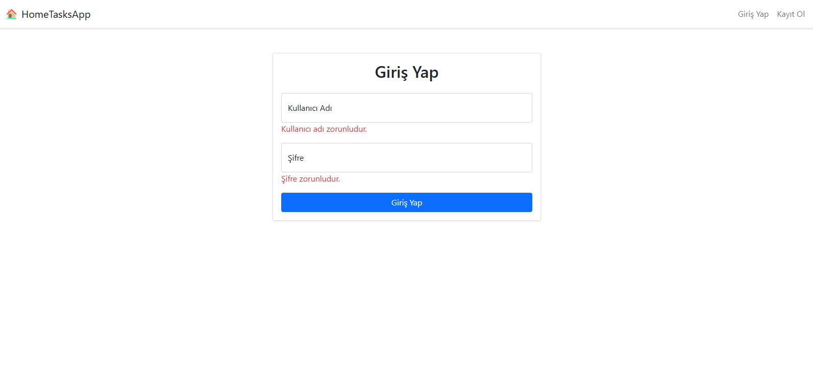

### 🧾 Kayıt Sayfası 
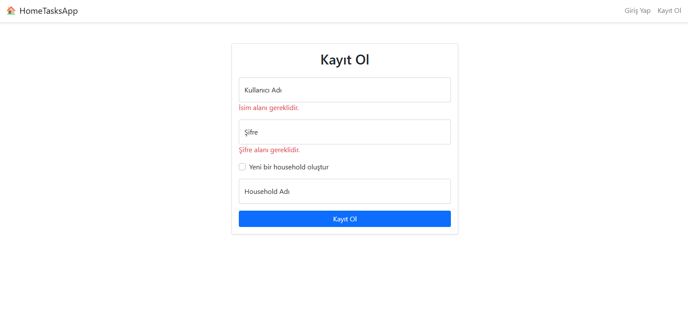

### 👤 Ana Sayfa 
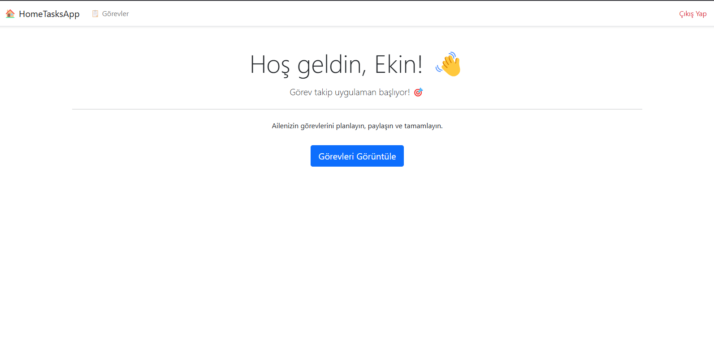

### 📋 Görev Listesi - Aile Reisi
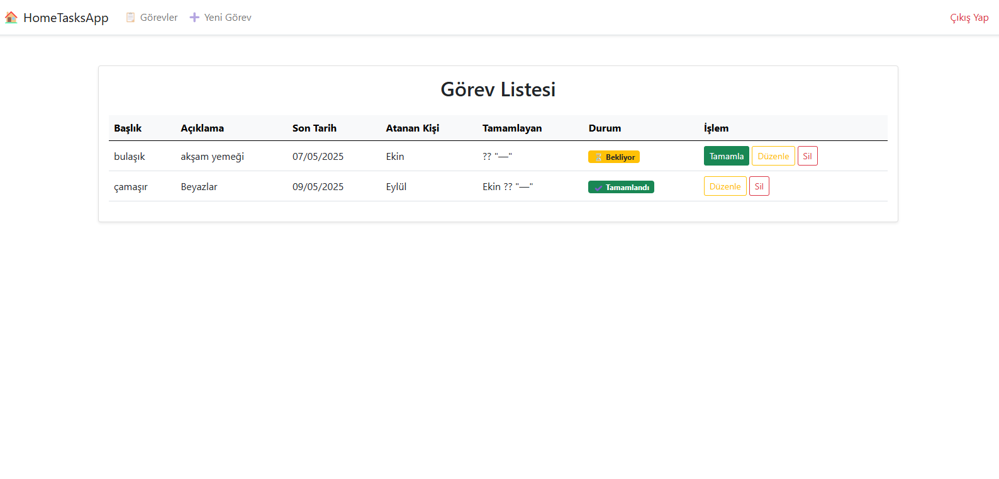

### 📋 Görev Listesi – Kullanıcı 
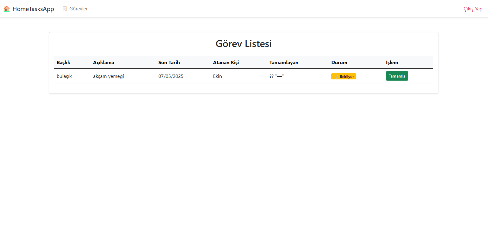

### ➕ Görev Oluştur - Aile Reisi
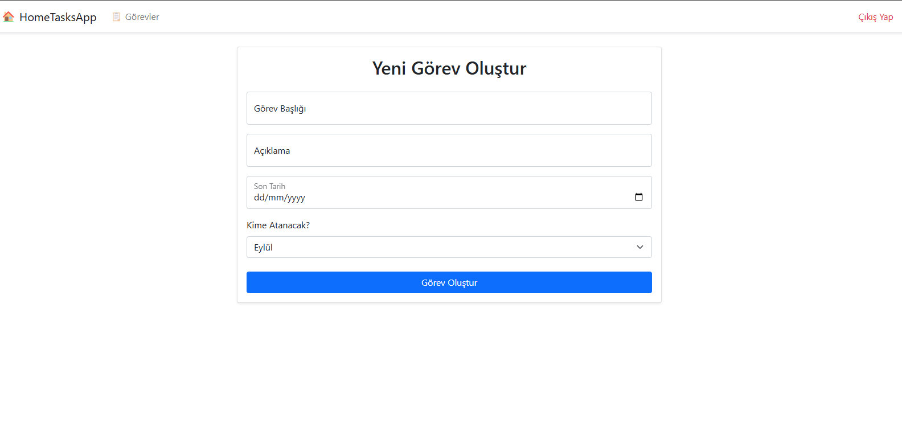

### 📝 Görev Düzenle -Aile Reisi
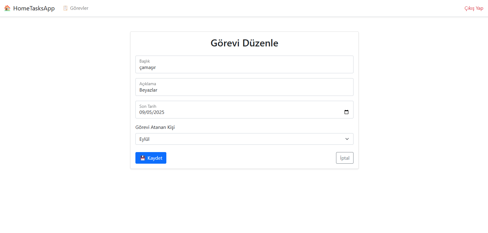

### ❌ Görev Sil - Aile Reisi
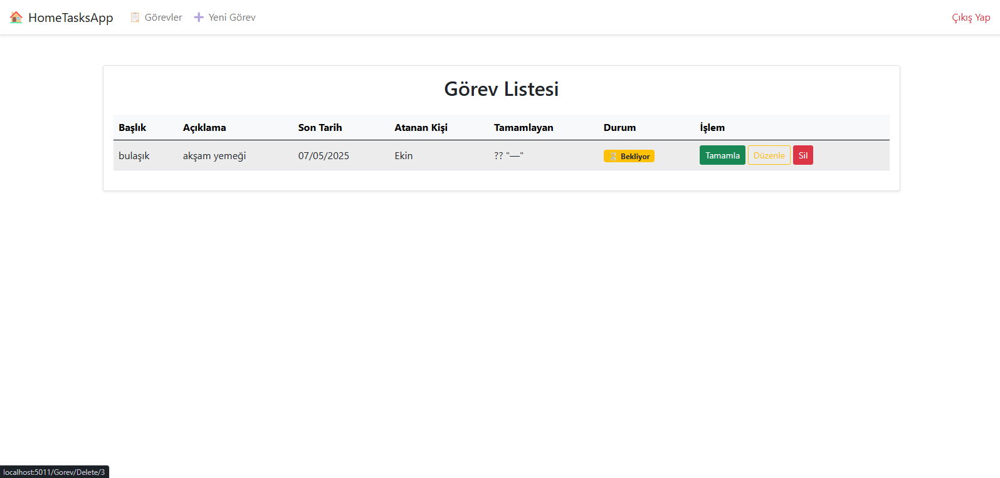

### 🔄 Boş Görev Listesi  
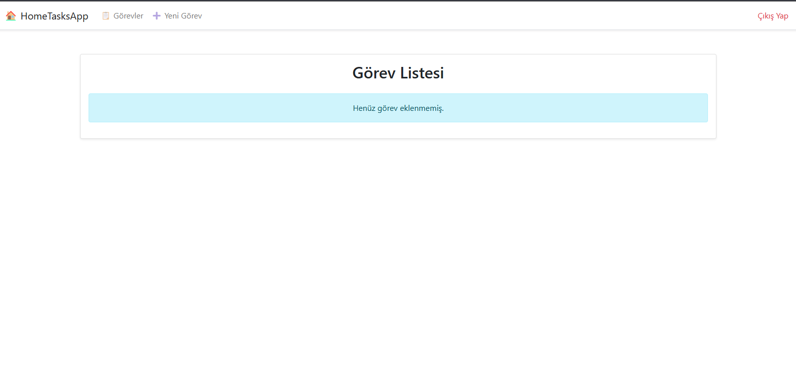

### 📊 Hane Görev Paneli  - Aile Reisi
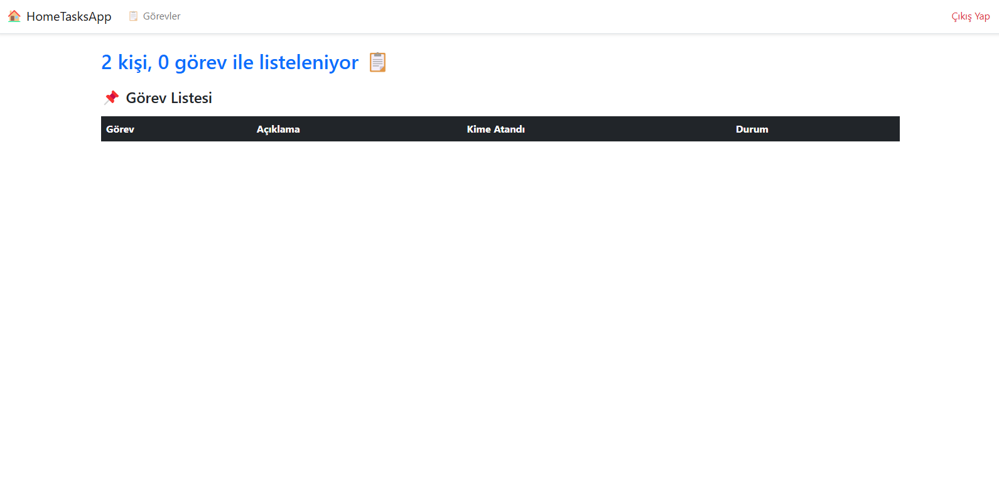

### 🧑‍💼 Admin Paneli
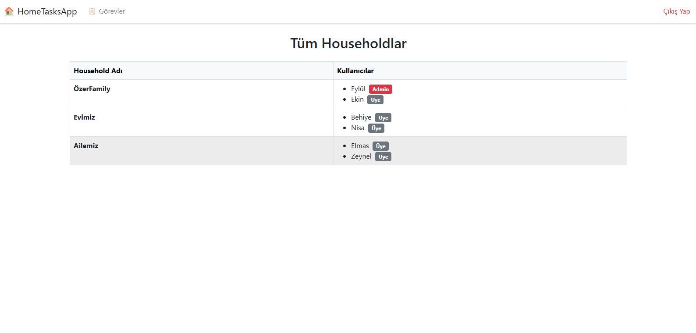


## ⚙️ Kullanılan Teknolojiler

- ASP.NET Core MVC (.NET 8)
- Entity Framework Core
- MSSQL Server (LocalDB veya tam sürüm)
- Bootstrap 5
- Session tabanlı kimlik doğrulama


---
